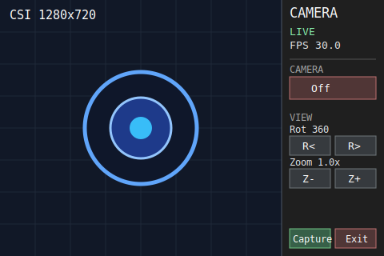
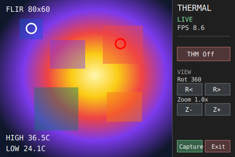
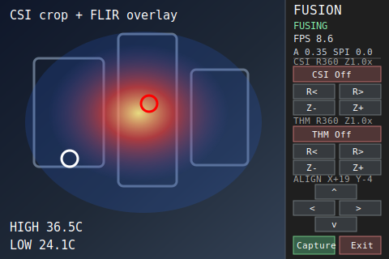

# UI Viewer Reference

These SVGs are static runtime-layout references for the local OpenCV viewer
applications. They document the expected 480x320 window shape, image viewport,
and right-side control panels without opening CSI, FLIR, SPI, or I2C hardware.

The OpenCV applications render raster windows at runtime, so these files are
not camera captures and do not include real sensor data.

## Camera UI

Runtime app: `ui/camera_ui.py`

## Thermal UI

Runtime app: `ui/thermal_ui.py`

## Fusion UI

Runtime app: `ui/fusion_ui.py`

